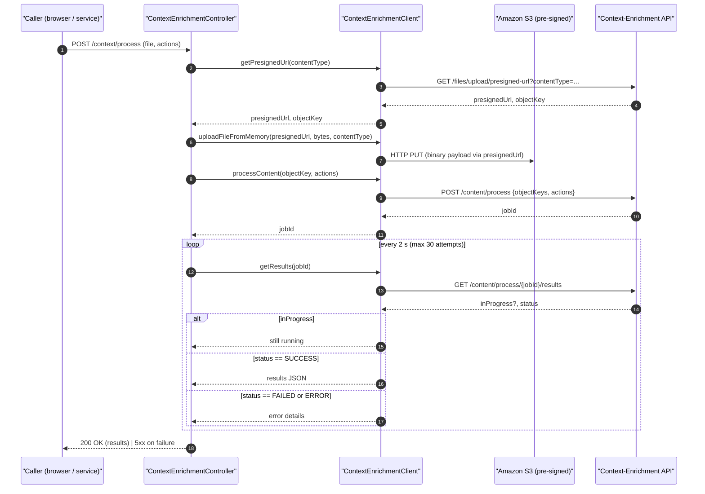
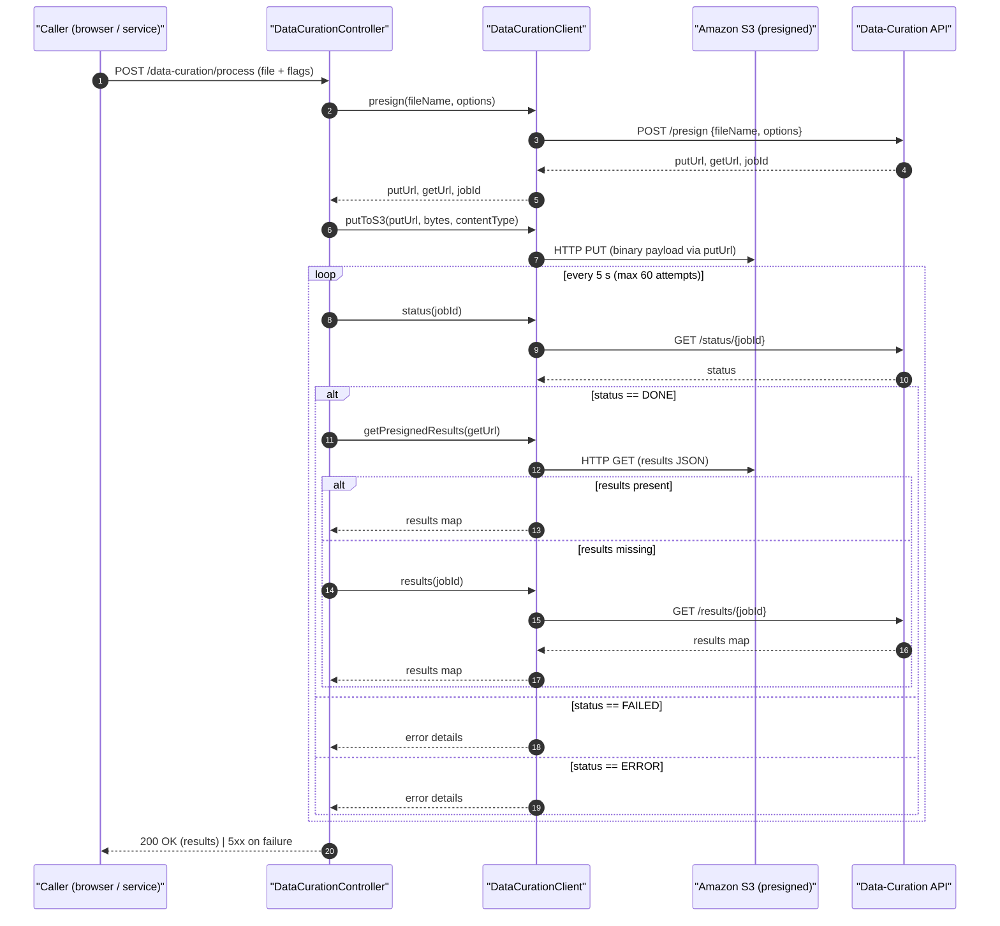

# Knowledge Enrichment API Gateway

[](https://openjdk.org/projects/jdk/21/)

> **A lightweight Spring Boot proxy that lets you prototype locally against the Hyland Knowledge Enrichment SaaS APIs: no S3 juggling or OAuth plumbing required.**

## Features

* **Single local endpoint** – Expose both Context Enrichment and Data Curation APIs on `http://localhost:8080`.
* **Credential firewall** – Keep OAuth2 secrets on the server; clients only see your gateway.
* **Straightforward uploads** – Send ordinary `multipart/form-data`; forget about presigned URLs.
* **One‑call polling** – Retrieve job status and results with a single request.
* **First‑class Docker support** – Spin up a ready‑to‑use container in seconds.

## Table of Contents

* [Why](#why)
* [Prerequisites](#prerequisites)
* [Quick Start](#quick-start)
  * [Docker](#docker)
* [Configuration](#configuration)
* [HTTP API](#http-api)
  * [Context Enrichment](#context-enrichment)
  * [Data Curation](#data-curation)
* [Examples](#examples)
* [Sequence Diagrams](#sequence-diagrams)
* [Contributing](#contributing)
* [Resources](#resources)

## Why

Hyland Knowledge Enrichment currently offers two public SaaS endpoints:

| Service                | Purpose                                                                       | Output            |
| ---------------------- | ----------------------------------------------------------------------------- | ----------------- |
| **Context Enrichment** | Run one‑off AI actions (summarise, translate, redact PII...) on a single binary    | JSON              |
| **Data Curation**      | Normalise, chunk and embed large documents for retrieval‑augmented generation | Vector‑ready JSON |

Both sit behind OAuth2 and presigned S3 URLs. This gateway abstracts that complexity so you can focus on experimenting, demoing or integrating.

## Prerequisites

| Requirement | Version                           |
| ----------- | --------------------------------- |
| Java        | 21+                               |
| Maven       | 3.9+ (wrapper provided)           |
| Docker      | *(optional for container builds)* |

## Quick Start

```bash
# 1. Build
mvn clean package

# 2. Configure credentials (once)
cp .env.sample .env
vi .env             # paste your SaaS creds
source .env

# 3. Run locally
./run.sh            # http://localhost:8080
```

### Docker

Ensure you have a local `.env` file containing credential values

```bash
docker compose up --build
```

The application will be reachable at [http://localhost:8080](http://localhost:8080).

## Configuration

Environment variables:

| Variable                                                           | Description          |
| ------------------------------------------------------------------ | -------------------- |
| `DATA_CURATION_CLIENT_ID` / `CONTEXT_ENRICHMENT_CLIENT_ID`         | OAuth2 client ID     |
| `DATA_CURATION_CLIENT_SECRET` / `CONTEXT_ENRICHMENT_CLIENT_SECRET` | OAuth2 client secret |
| `DATA_CURATION_API_URL` / `CONTEXT_ENRICHMENT_API_URL`             | Base SaaS REST URL   |
| `DATA_CURATION_OAUTH_URL` / `CONTEXT_ENRICHMENT_OAUTH_URL`         | OAuth token endpoint |

See `application.yaml` for optional port or logging tweaks.

## HTTP API

### Context Enrichment

| Method | Endpoint                     | Body / Query                                | Description                                      |
| ------ | ---------------------------- | ------------------------------------------- | ------------------------------------------------ |
| `GET`  | `/context/available_actions` | –                                           | List supported actions                           |
| `POST` | `/context/process`           | `multipart/form-data` → `file`, `actions[]` | Upload a binary, trigger actions, return results |

### Data Curation

| Method | Endpoint                 | Body                                             | Description                                     |
| ------ | ------------------------ | ------------------------------------------------ | ----------------------------------------------- |
| `POST` | `/data-curation/process` | `file`, `normalization`, `chunking`, `embedding` | Upload a PDF and run any or all pipeline stages |

## Examples

```bash
# List available actions
curl -X GET http://localhost:8080/context/available_actions

# Summarise a PDF
curl -F actions=text-summarization -F file=@document.pdf \
     http://localhost:8080/context/process

# Run the full curation pipeline
curl -F file=@document.pdf -F normalization=true \
     -F chunking=true -F embedding=true \
     http://localhost:8080/data-curation/process
```

## Sequence Diagrams





## Contributing

Pull requests are welcome! Please open an issue first to discuss your proposed change.

## Resources

* [Official Documentation](https://hyland.github.io/ContentIntelligence-Docs/KnowledgeEnrichment)
* [Hyland Beta Program](https://www.hyland.com/en/learn/it/beta-program)
