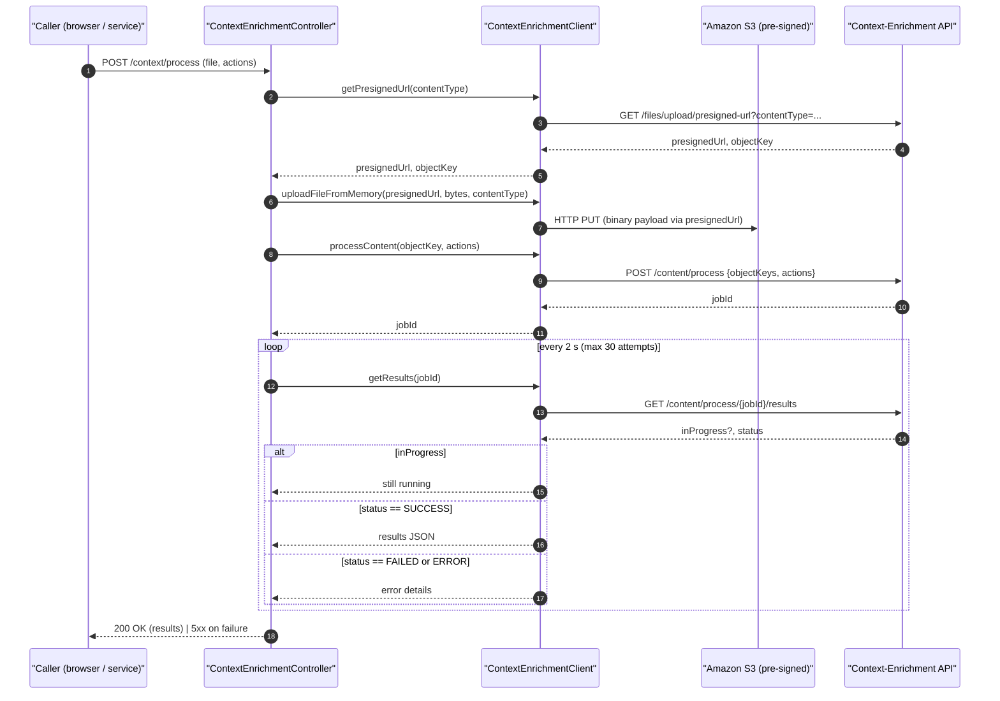
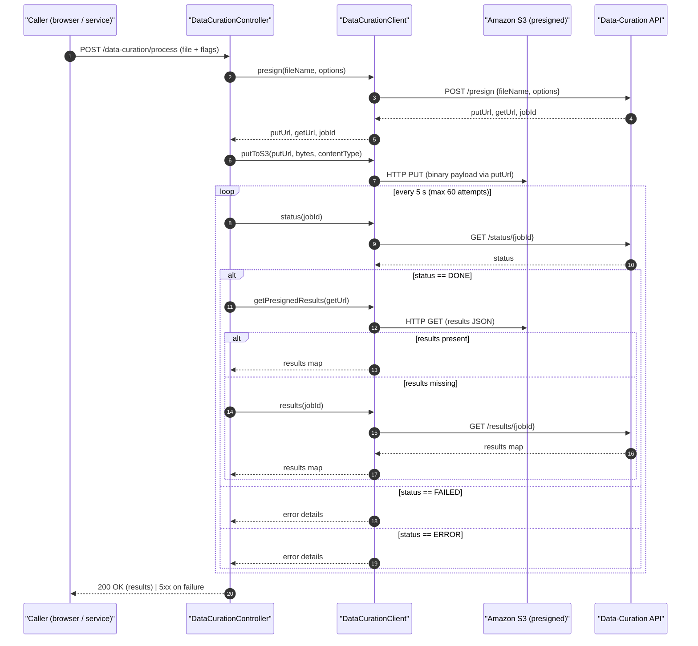

# Knowledge Enrichment API Gateway

*The one‑stop Spring Boot service that lets you experiment locally with [Hyland Knowledge Enrichment](https://www.hyland.com/en/resources/articles/what-can-you-do-with-knowledge-enrichment) SaaS APIs*

Upload any document, choose the actions you want (summarisation, entity extraction, OCR...), poll for the results, or feed a PDF into the curation pipeline and watch it get normalised, chunked and embedded.

## Table of Contents

- [Why this exists](#why-this-exists)
- [Quick start](#quick-start)
- [Configuration](#configuration)
- [Running with Docker](#running-with-docker)
- [HTTP API](#http-api)
  - [Context Enrichment](#context-enrichment)
  - [Data Curation](#data-curation)
- [Smoke‑test recipes](#smoke‑test-recipes)
- [Internals worth knowing](#internals-worth-knowing)
- [Sequence diagrams](#sequence-diagrams)
  - [Context Enrichment life‑cycle](#context-enrichment-life‑cycle)
  - [Data Curation life‑cycle](#data-curation-life‑cycle)
- [Additional Resources](#additional-resources)

## Why this exists

The Hyland Knowledge Enrichment currently exposes two public APIs:

| Remote API             | Purpose                                                                       | Typical output                                   |
| :--------------------- | :---------------------------------------------------------------------------- | :----------------------------------------------- |
| **Context Enrichment** | Run one‑off AI actions (summarise, translate, detect PII,...) on a single blob | JSON result per action                           |
| **Data Curation**      | Prepare large content for retrieval‑augmented generation pipelines            | Normalised / chunked JSON with vector embeddings |

Both services live behind OAuth2 and S3‑style presigned URLs. This gateway hides all of that complexity so you can:

* keep credentials out of your client code, set them once as env vars
* prototype locally, everything is proxied on port `8080`
* use familiar multipart uploads, instead of juggling presigned PUTs
* poll with a single call, no need to follow redirects or cache URLs

If you only need one command to test the platform, this is it.

## Quick start

```bash
# 1. Build
mvn clean package

# 2. Provide credentials
vi .env                                     # edit with your SaaS creds
export $(grep -v '^#' .env | xargs)         # linux/mac

# 3. Run
./run.sh                                    # starts on http://localhost:8080
```

## Configuration

| Variable                                                           | Description                                                     |
| :----------------------------------------------------------------- | :-------------------------------------------------------------- |
| `DATA_CURATION_CLIENT_ID` / `CONTEXT_ENRICHMENT_CLIENT_ID`         | OAuth2 client id                                                |
| `DATA_CURATION_CLIENT_SECRET` / `CONTEXT_ENRICHMENT_CLIENT_SECRET` | OAuth2 secret                                                   |
| `DATA_CURATION_API_URL` / `CONTEXT_ENRICHMENT_API_URL`             | Base REST URL                                                   |
| `DATA_CURATION_OAUTH_URL` / `CONTEXT_ENRICHMENT_OAUTH_URL`         | OAuth token endpoint                                            |

Copy `application.yaml` if you need to tweak ports or logging.

## Running with Docker

Start the application by running

`docker compose up --build`

The application will be available at http://localhost:8080.

## HTTP API

### Context Enrichment

| Method | Path                         | Body / Query                                | Purpose                                   |
| :----- | :--------------------------- | :------------------------------------------ | :---------------------------------------- |
| `GET`  | `/context/available_actions` | –                                           | List actions supported by the remote SaaS |
| `POST` | `/context/process`            | `multipart/form-data` ⇒ `file`, `actions[]` | Upload a blob and fetch the result             |

### Data Curation

| Method | Path                                  | Body                                                             | Purpose                                      |
| :----- | :------------------------------------ | :--------------------------------------------------------------- | :------------------------------------------- |
| `POST` | `/data-curation/process`               | `file`, `normalization`, `chunking`, `embedding`                | Upload a blob and fetch the result             |

## Smoke‑test recipes

Below are copy‑paste‑ready `curl` calls that hit every endpoint in order. Replace the filenames and action list to suit your use case.

```bash
# Discover what the SaaS can do
curl --request GET \
  --url http://localhost:8080/context/available_actions
```

```bash
# Get summarisation on a PDF
curl --request POST \
  --url http://localhost:8080/context/process \
  --header 'Content-Type: multipart/form-data' \
  --form actions=text-summarization \
  --form file=@somatosensory.pdf
```

```bash
# Run the full curation pipeline for a PDF
curl --request POST \
  --url http://localhost:8080/data-curation/process \
  --header 'Content-Type: multipart/form-data' \
  --form file=@somatosensory.pdf \
  --form normalization=true \
  --form chunking=true \
  --form embedding=true
```

## Internals worth knowing

* **OAuthTokenManager** caches access tokens for 50 minutes (`security.token-cache-duration`)
* **AbstractApiClient** adds automatic retry with exponential back‑off (3 tries by default)
* File MIME‑type detection is delegated to **Apache Tika** (handles edge‑cases such as `.md` or missing extensions)
* The curation controller persists presigned **GET** URLs in an in‑memory store to avoid an extra round‑trip on every poll

## Sequence diagrams

Below you’ll find end‑to‑end sequence diagrams that show every hop from the first `curl` to the SaaS micro‑service and back

### Context Enrichment life‑cycle



### Data Curation life‑cycle



## Additional Resources

* Official Documentation: https://hyland.github.io/ContentIntelligence-Docs/KnowledgeEnrichment
* Beta Program: https://www.hyland.com/en/learn/it/beta-program